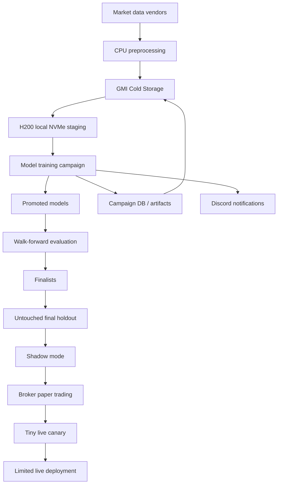
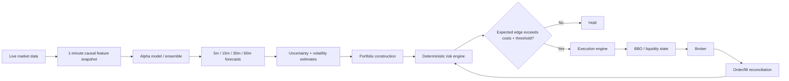
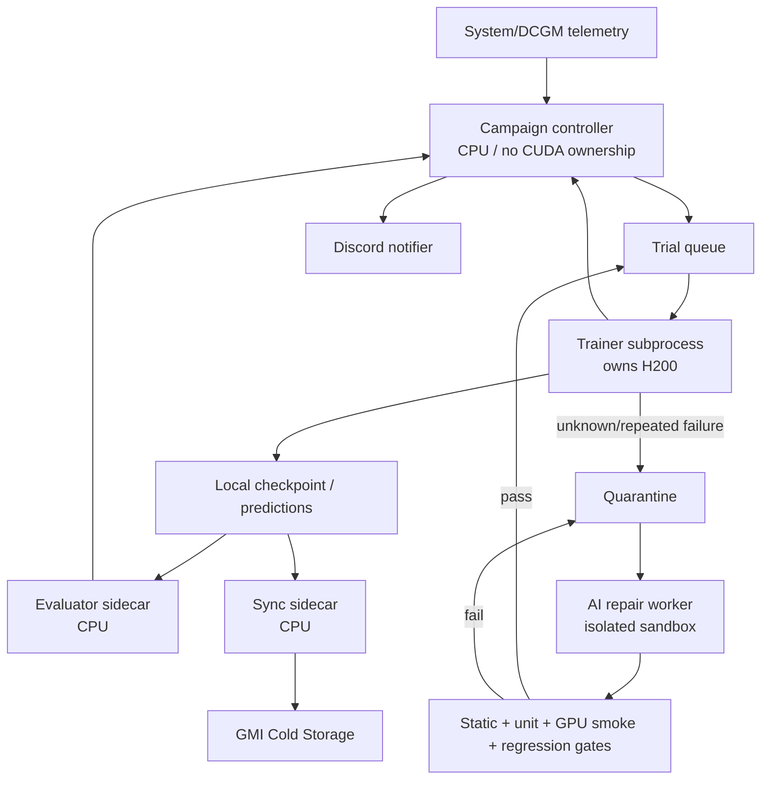
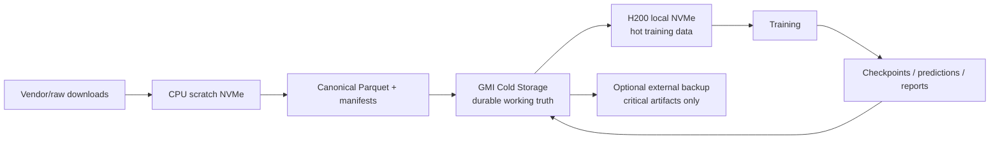

# System Architecture

Status: **BASELINE**

## Research-to-live system

## Medium-frequency live decision path

The model never has authority to bypass the deterministic risk engine. Broker acknowledgements and reconciled positions are authoritative in live operation.

## H200 campaign topology

## Storage tiers

## Component boundaries

### Data layer

Responsible for vendor ingestion, security master, corporate actions, point-in-time universe, causal features, labels, split definitions, validation, and dataset manifests.

### Research/model layer

Responsible for common model interfaces, architecture implementations, custom kernels, objectives, checkpointing, and prediction generation. It does not decide what constitutes a valid backtest.

### Evaluation layer

Owns the canonical return/cost accounting and all frozen model-selection metrics. Models provide predictions; the evaluator determines economic results.

### Campaign layer

Owns trial scheduling, deadline management, retries, promotion, pruning, health checks, AI-repair escalation, and durable campaign state. It does not change scientific contracts mid-campaign.

### Execution/risk layer

Owns target-to-order conversion, cost/latency/liquidity logic, broker reconciliation, position limits, stale-data rejection, loss limits, and kill switches. This layer remains independent from the learned alpha model.

## Non-goal: true HFT

The project is not designed around co-location, direct exchange feed parsing, microsecond order-to-ack latency, FPGA/kernel-bypass networking, or thousands of orders per second. Deeper order-book and multi-agent work may later be used to improve **execution** while preserving the medium-frequency alpha horizon.
